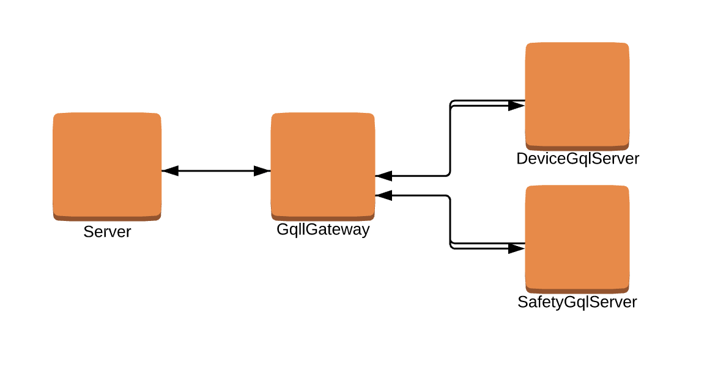

# Graphql Federation

In our current world, we have a single graphql schema that contains all the objects and field funcs that can be executed. However, as the number of objects and field funcs scale, we want to allow product teams to each have their own gqlserver that contains the portion of the gqlschema relevant to the product team.

Federation helps by creating a service called the gqlgateway that is aware of every team gqlserver, which team it belongs to, and the assocaited schema on the gqlserver. Queries are parsed at the main gateway and broken down to sub-queries, which are forwarded to the appropriate gqlservers for execution. The sub-queries only contains field funcs that the team's gqlserver are able to resolve. After receiving all results from the sub-queries, the main gateway stitches all the sub-query results into a single result to respond to the original query from the client. This ensures the client can query any field while the schema is federated under the hood. 

Federation will provide teams more ownership over graphql schema and isolate graphql execution to provide more operational stability.

## Architecture Diagram



## API 

If an object entirely belongs to a gqlserver, it can exist on only that gqlserver with all of its field funcs. However, there are some objects that have fields that belong to multiple gqlservers. We call these federated objects. 

A non-federated object looks something like this example below 
```
type Device struct {
    Id            int64
    OrgId         int64
    Name          string
}
device := schema.Object("Device", Device{})
```

A federated object has an extra field called FetchObjectFromKeys that takes a function, telling the gqlserver how to fetch the full object using federated key; the minimum number of fields required to fetch the object. A federated object can exist on multiple gqlservers and have different field funcs on each gqlserver.

```
type Device struct {
    Id            int64
    OrgId         int64
    Name          string
}
// Device keys has to be a subset of the fields on Device and is the minimum information needded to fetch a full Device
type DeviceKeys struct {
    Id            int64
    OrgId         int64
}
device := schema.Object("Device", Device{}, schemabuilder.FetchObjectFromKeys(func(args struct{ Keys []*DeviceKeys }) []*Device {
    // Fetch device from database using device keys    
    return fetchedDevices
}))
```


## Example

At samsara we create IoT devices used for vehicle monitoring. One type of the devices is a camera owned by our safety team, but the other types of devices don't belong to the safety team. In this example, we want to have 2 gqlservers, devicegqlserver and safetygqlserver. The safetygqlserver is suppose to have all the field funcs pertaining to the camera. 

To do this, on safetyserver we add a field called `camera`
```
device.FieldFunc("camera", func(ctx context.Context, device *Device) ([]*Camera , error) {
		return []*Camera{&Camera{Id: 1, IsOn: true}, &Camera{Id: 2, IsOn: true}}, nil
	})
```

We then register the `camera` object and the field func `cameraLocation`
``
type Camera struct {
  Id int64
  IsOn bool
}
camera := schema.Object("Camera", Camera{})
camera.FieldFunc("cameraLocation", func(ctx context.Context, camera *Camera) (*Location , error) {
  return &Location{Latitude: 246.245, Longitude: 135.135}, nil
})
```

This devicegqlserver schema can be found in `federationexample/devicegqlserver/main.go` and the safetygqlserver schema can be found `federationexample/safetyservice/main.go`. 

Let's run a following query. The comment indicates which gqlserver is resolving each field. 
```
{
  device {                  #devicegqlserver
    camera{                 #safetygqlserver
      cameraLocation {      #safetygqlserver
        street              #devicegqlserver
   	  }
    }
  }
}
```


When the gateway parses this query, it first makes a request to devicegqlserver. It adds all the fields that exist on devicegqlserver, and when it sees a field it doesn't know how to resolve, it replaces it with the field func `_federation` and adds the deviceKeys (id and orgId) fields nested under `_federation` field.

```
{
  device {                  # devicegqlserver
    _federation {           # replaces camera field
        id                  # device key 
        orgId               # device key 
    }
  }
}

```

Once the gateway receives the response from devicegqlserver, it forwards another sub-query to safetygqlserver to resolve the `camera` and `cameraLocation` field. 

The args `deviceKeys` are a list of `DeviceKey` structs with `id` and `orgId` populated from the results of the previous sub-query to devicegqlserver. The field `Device_safetygqserver` executes the `FetchObjectFromKeys` function defined on the device object. It takes a list of `deviceKeys` and returns a list of  `Device` objects.

Safetygqlserver can resolve all the fields but street name, so it once again replaces `street` with the `_federation` field and adds the keys `latitude` and `longitude` as fields. 

```
{
    _federation {
      Device_safetygqlserver(args: deviceKeys) {
        camera{                    # safetygqlserver
          cameraLocation {       # safetygqlserver
            _federation {      # replaces 
              latitude
              longitude
            }
          }
        }
      }
    }
}
```
Once the gateway gets the result from the sub-query to safetygqlserver, it makes one more request to deviceservice to resolve `street` field. It sends the `locationKeys` as arguments.

```
{
  _federation {
    Location_devicegqlserver(args: locationKeys) {
      street
    }
  }
}
```

After all fields from the original query are resolved, the gateway stitches the results into a single response to conform to request query shape.

## How to run the example
Run the bash script `./runfederationexample.sh` and go to the url `http://localhost:3030/federationexample`. Below is a sample query you can run, but you should be able to explore the schema and write your own queries. 

```
{
  device {                  #devicegqlserver
    id                      #devicegqlserver
    location {              #devicegqlserver
      latitude              #devicegqlserver
      longitude             #devicegqlserver
      street                #devicegqlserver
    }
    camera {                #safetygqlserver
      id                    #safetygqlserver
      isOn                  #safetygqlserver
      isMultiCam            #safetygqlserver
      cameraLocation {      #safetygqlserver
      	latitude            #safetygqlserver
      	longitude           #safetygqlserver
        street              #devicegqlserver
   	  }
    }
  }
}
```

